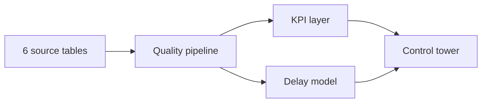

<div align="center">

# FreightPlus

### Inbound Logistics Control Tower

[](https://shrutivan17.github.io/FreightPlus/)


</div>

[](https://shrutivan17.github.io/FreightPlus/)

| **54,840** shipments | **81.2%** OTIF | **$163.3M** freight spend | **1.68×** risk lift |
|:---:|:---:|:---:|:---:|

## Explore

| Live view | Decision |
|---|---|
| Service pulse | Track OTIF and on-time delivery |
| Carrier scorecards | Compare service, delay, damage and cost |
| Exception map | Find capacity, congestion and weather exposure |
| Risk queue | Prioritize shipments before the promise is missed |

## Flow



## Stack

`Python` · `Pandas` · `scikit-learn` · `PostgreSQL` · `Streamlit` · `JavaScript` · `Docker` · `GitHub Actions`

## Run

```bash
pip install -r requirements.txt
python src/generate_data.py
python src/analyze.py
streamlit run app.py
```

> All carriers, facilities, shipments and operational results are synthetic. No retailer data is used.
