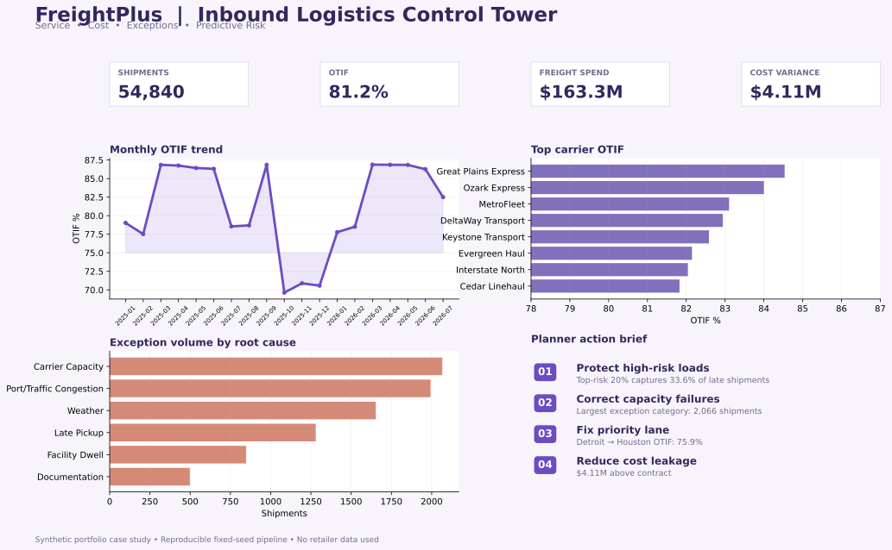
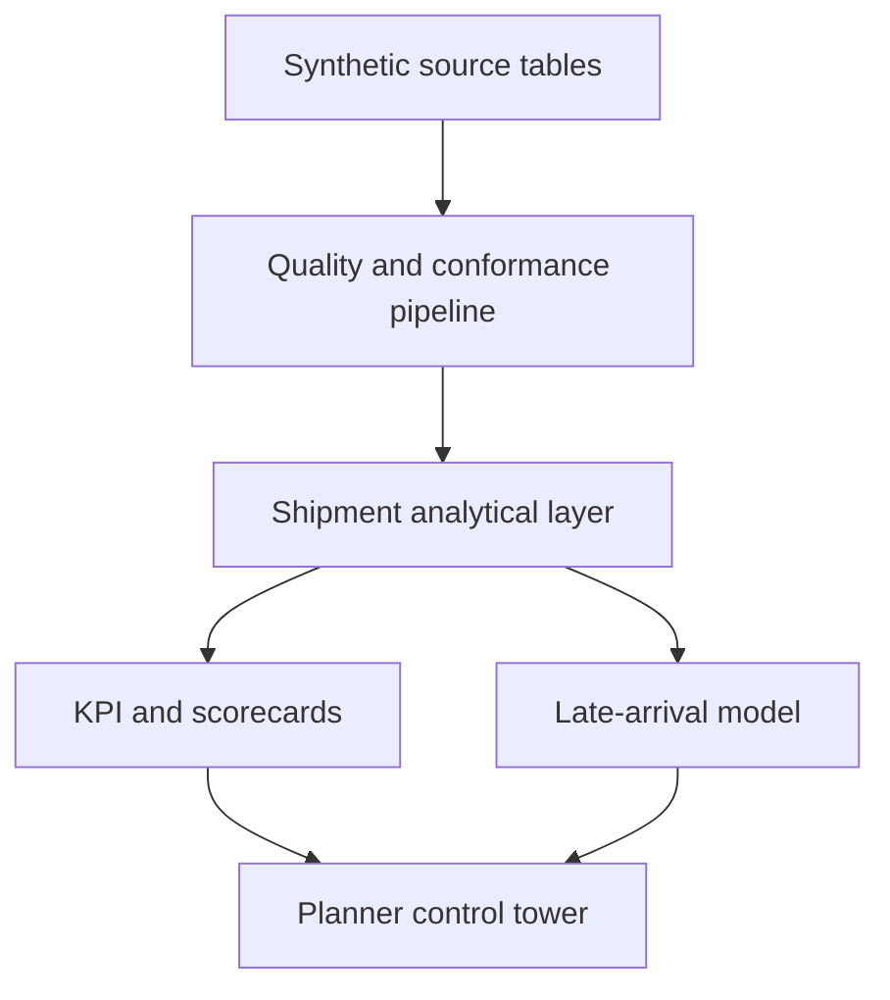

# FreightPlus: Inbound Logistics Exception Analytics & Planning Dashboard

An end-to-end retail transportation analytics case study that turns shipment, carrier, facility, lane, cost, and inventory data into a planner-ready control tower.




> Portfolio disclosure: every organization, carrier, shipment, value, and result in this repository is synthetic. The project demonstrates analytical methods; it does not use or represent Walmart data.

## Why this project matters

Transportation teams often see service, freight cost, exceptions, and inventory exposure in separate reports. FreightPlus connects them around the shipment grain, then answers four operating questions:

1. Is the inbound network meeting its OTIF promise?
2. Which carriers, lanes, and facilities are driving the gap?
3. What exception types create the most delay and cost exposure?
4. Which in-transit shipments should a planner contact first?

## Demonstrated scope

- **55,110 raw shipment rows** representing 55,000 unique shipments
- **75,411 purchase orders**, 120 lanes, 15 fictional carriers, and 12 facilities
- **5,616 weekly inventory snapshots** by facility and product category
- SQL data model and six decision-oriented analysis queries
- Python quality pipeline, KPI layer, carrier/lane scorecards, and time-aware risk model
- Four-tab Streamlit control tower with filters and a shipment intervention queue
- Business requirements, definitions, acceptance criteria, and reproducible outputs
- GitHub Actions pipeline that regenerates data and validates analytical integrity on every push

## Architecture



## Reproducible findings

The included run produced these results after removing duplicates, repairing route-to-facility mappings, and excluding incomplete deliveries only from service calculations:

| Measure | Result |
|---|---:|
| Unique shipments analyzed | 54,840 |
| OTIF | 81.20% |
| On-time delivery | 83.42% |
| In-full delivery | 97.19% |
| Exception rate | 16.81% |
| Freight spend | $163.35M |
| Cost above contract | $4.11M |
| Data-quality issues detected | 520 |
| Delay model ROC-AUC | 0.6242 |
| Top-risk 20% lift | 1.68× |

The clearest operational story is not a black-box accuracy claim: **capacity and congestion create the most exception volume, while weather produces the longest average delay.** The top-ranked intervention lane is Detroit → Houston, with 75.94% OTIF and $55.5K in positive cost variance in the generated period. The model intentionally uses only tender/dispatch-time fields; its top-risk 20% captures 33.55% of late shipments, a 1.68× lift over an unprioritized queue.

## Dashboard pages

- **Executive view:** OTIF trend, freight spend, and facility service/cost exposure
- **Carriers & lanes:** carrier performance matrix and prioritized lane table
- **Exceptions:** Pareto view of exception volume, delay, and cost exposure
- **Risk queue:** probability bands and the 30 shipments most likely to arrive late

## Repository map

```text
app.py                         Streamlit dashboard
assets/                        Recruiter-friendly dashboard preview
src/generate_data.py           Deterministic synthetic data generator
src/analyze.py                 Quality, KPI, scorecard, and ML pipeline
sql/schema.sql                 PostgreSQL-compatible analytical schema
sql/analysis_queries.sql       Executive, carrier, lane, exception, trend, and DQ queries
docs/business_requirements.md  Stakeholders, rules, requirements, and acceptance criteria
docs/data_dictionary.md        Table grains and governed KPI definitions
data/raw/                      Six locally generated source tables (Git-ignored)
data/processed/                Locally generated analytical table (Git-ignored)
outputs/                       KPI, quality, scorecard, lane, exception, and risk results
executive_summary.html         Locally generated no-install interactive report
.github/workflows/ci.yml       Reproducibility and integrity checks
```

## Run locally

```bash
python -m venv .venv
source .venv/bin/activate      # Windows: .venv\Scripts\activate
pip install -r requirements.txt
python src/generate_data.py
python src/analyze.py
python src/build_static_report.py
streamlit run app.py
```

The generator uses a fixed seed, so a clean run recreates the documented results.

### Docker option

```bash
docker build -t freightplus .
docker run -p 8501:8501 freightplus
```

Open `http://localhost:8501`.

## Analytical integrity

- Time-ordered 70/15/15 train, validation, and test split prevents future data from leaking backward.
- The alert threshold is chosen on validation data and reported on the untouched test period.
- Missing delivery timestamps are retained in the quality report and excluded only from service KPIs.
- Facility mappings are repaired from the governed route master; duplicate shipment IDs are removed.
- Large generated datasets are not committed. Reviewers reproduce them from the fixed-seed generator.


## Responsible use

This project is intentionally indirect: it demonstrates retail transportation reasoning without implying employment, confidential access, or real operational performance from any named retailer.
