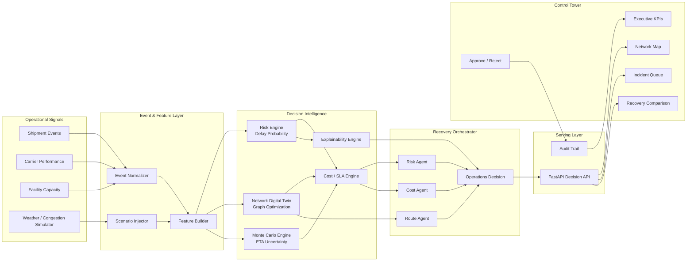

# GhostRoute AI — Architecture

GhostRoute AI is an event-driven freight disruption recovery platform designed to detect shipment risk, evaluate recovery options, and produce an explainable operational decision.

## System Architecture



## Why this architecture is strong

### 1. Event-driven, not dashboard-only
A disruption is injected as an operational event. The platform recomputes shipment risk and recovery options immediately.

### 2. Digital twin
The transportation network is modeled as a graph. Recovery alternatives are evaluated as network paths rather than hard-coded text.

### 3. Uncertainty-aware decisions
Monte Carlo simulation produces an ETA distribution and SLA-breach probability instead of pretending one ETA is certain.

### 4. Multi-objective recovery
Every route is scored across delay, cost, SLA risk, and operational feasibility.

### 5. Explainable decision layer
The system reports the drivers behind a risk score and the trade-off behind the recommended recovery.

### 6. Human-in-the-loop
GhostRoute recommends actions; a user approves or rejects them. Decisions are auditable.

## Free-tier deployment profile

The submission does not require paid AI APIs. The deterministic decision engine runs locally or in one small Cloud Run service.

- Frontend: static HTML/CSS/JavaScript
- API: FastAPI
- Data: synthetic JSON/in-memory for demo
- Optional persistence: Firestore
- Optional analytics: BigQuery sandbox/free usage
- Optional LLM narrative: Gemini can be added later, but is not required

Recommended Cloud Run configuration:

```
min instances: 0
max instances: 1
CPU: 1
memory: 512 MiB
concurrency: 20
```

## Request path

```
Judge clicks "Inject Disruption"
        ↓
POST /api/disrupt
        ↓
Scenario event created
        ↓
Risk score recalculated
        ↓
Alternative paths generated
        ↓
Monte Carlo ETA simulation
        ↓
Cost + SLA trade-off ranking
        ↓
Explainable recommendation
        ↓
Dashboard updates
        ↓
Judge approves / rejects action
```

## Design principle

The AI layer is not allowed to invent operational numbers. Numeric decisions come from deterministic analytics and optimization. A language model, if enabled later, only translates those grounded results into natural-language explanations.
